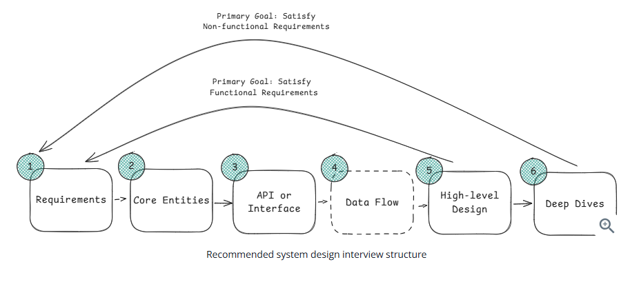

# Requirements ~5 minutes
### Functional Requirements - User should be able to...
* Users should be able to post tweets
* Users should be able to follow other users
* Users should be able to see tweets from users they follow

### Non-Functional Requirements - The system should be able to...
* The system should be highly available, prioritizing availability over consistency
* The system should be able to scale to support 100M+ DAU (Daily Active Users)
* The system should be low latency, rendering feeds in under 200ms8

#### non-functional requirements checklist
1. CAP Theorem
2. Env Constraints
3. Scalability
4. Latency
5. Durability
6. Security
7. Fault-tolerance
8. Compliance

# Core Entities ~ 2 minutes
For our Twitter example, our core entities are rather simple:
* User
* Tweet
* Follow

A couple useful questions to ask yourself to help identify core entities:
* Who are the actors in the system? Are they overlapping?
* What are the nouns or resources necessary to satisfy the functional requirements?

# API or System Interface ~ 5 minutes
You have a quick decision to make here -- which API protocol should you use?
* **REST (Representational State Transfer)**: Uses HTTP verbs (GET, POST, PUT, DELETE) to perform CRUD operations on resources. This should be your default choice for most interviews.
* **GraphQL**: Allows clients to specify exactly what data they want to receive, avoiding over-fetching and under-fetching. Choose this when you have diverse clients with different data needs.
* **RPC (Remote Procedure Call)**: Action-oriented protocol (like gRPC) that's faster than REST for service-to-service communication. Use for internal APIs when performance is critical.
Don't overthink this. Default to REST unless you have a specific reason not to. For real-time features, you'll also need WebSockets or Server-Sent Events, but design your core API first.